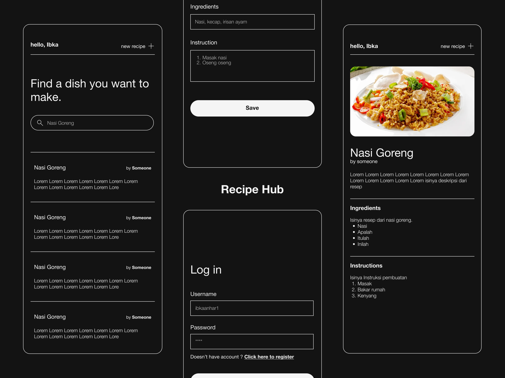

 

    <h3 align="center">Recipe Hub</h3>

  

Recipe Hub is an mobile application platform where you can share your own recipe and find recipe for a specific dish that you want to make. 
  

## Preview

## Built With

## Authors
- [Ibka Anhar Fatcha (41522010137)](https://github.com/letha11)  
- [Chandra Renoval Saputra (41522010135)](https://github.com/ChandraRenovalSaputra)  
- [Shafrizal Fadillah Akbar (41522010122)](https://github.com/CloudsWinter)  
- [Adam Nur Zidane(41522010109)](https://github.com/MasZidaneee)  